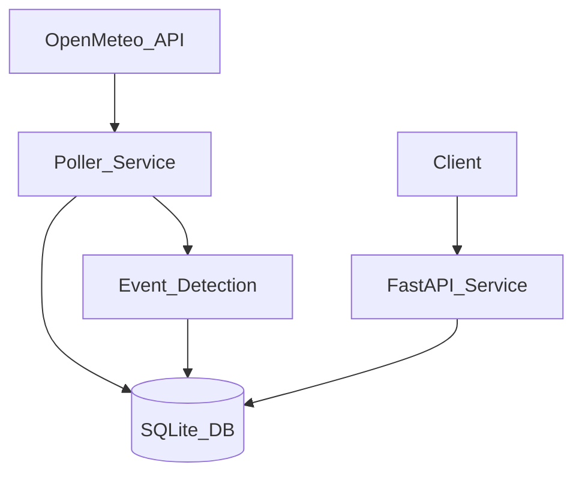

# WatchAgent: Weather Monitor & AI Assistant

WatchAgent monitors live weather for three Canadian cities, stores deduplicated readings, detects notable events, and exposes data through a FastAPI HTTP API.

Challenge reference: [WatchAgent Take-Home Challenge](https://watchagent-challenge.vercel.app/)

## System Overview

The system has two runtime services:

- `poller`: fetches Open-Meteo `current` weather for Ottawa, Toronto, Vancouver
- `api`: serves `/health`, `/readings`, `/events`

Data is persisted in SQLite, shared by both services through a Docker volume.

## Architecture




## Data Source and Polling Contract

Source: Open-Meteo (`https://api.open-meteo.com/v1/forecast`) using `current` only:

- `temperature_2m`
- `apparent_temperature`
- `precipitation`
- `wind_speed_10m`
- `weather_code`

Fixed monitored cities:

- Ottawa: `45.4112, -75.6981`
- Toronto: `43.7064, -79.3986`
- Vancouver: `49.2497, -123.1193`

### Deduplication

Open-Meteo updates hourly, while polling runs more frequently.  
A reading is inserted only if `current.time` is newer than the latest stored timestamp for that city (`city + recorded_at` unique key).

## Event Detection Design

Detection runs only after a **new reading** is inserted.  
Each event stores: `city`, `occurred_at`, `event_type`, `summary`, `reason`, `details`.

Implemented event types:

- `context_heat_extreme`
- `context_cold_extreme`
- `temp_drop_spike`
- `wind_spike`
- `rain_to_snow_transition`
- `thunderstorm_transition`
- `freezing_rain_transition`
- `blizzard_like_conditions`
- `humidex_gap_high`
- `cross_city_temp_divide`
- `national_storm_signal`

Design rationale:

- **Context-aware thresholds**: The same absolute temperature does not have equal operational impact across Canadian cities with different baselines. Vancouver is generally milder than Ottawa/Toronto, so the detector uses lower heat thresholds there and colder thresholds in Ottawa/Toronto. This avoids shallow global rules like `temp > 30`, which would under-alert in one city and over-alert in another.
- **Rate-of-change rules**: Absolute values miss rapid deterioration, which is often what creates immediate risk. A one-hour temperature drop with precipitation can indicate black-ice formation even when the final temperature is not “extreme.” Similarly, a sudden wind doubling that crosses a high-wind floor captures front/squall-like onset rather than normal hourly variability.
- **WMO transitions**: Weather-code transitions are used to detect phase/severity changes that are behaviorally meaningful (e.g., rain -> snow, entering freezing rain, entering thunderstorm codes). Triggering on transitions (instead of every repeated severe code) keeps events informative and lowers alert spam.
- **Cross-city rules**: Monitoring only city-local anomalies makes the system look like three independent weather feeds. Cross-city rules add national situational awareness by surfacing large thermal spreads and synchronized storm-like conditions. This provides macro insight that single-city thresholds cannot express.
- **Multi-variable rules**: Many impactful conditions are compound, not single-signal. Snow with strong wind is operationally different from snow alone; a large apparent-vs-air temperature gap indicates human-impact stress that dry-bulb temperature alone hides. Combining variables improves practical relevance and reduces false significance from one noisy field.

### Sensitivity vs Noise Tradeoff

This detector intentionally favors **selective, explainable events** over maximum firing rate.

- **Anti-noise controls**:
  - detection runs only on newly inserted timestamps (no duplicate-poll events)
  - transition-based WMO events fire on code changes, not repeated identical severe codes
  - cross-city rules require aligned timestamps across all three cities
- **Sensitivity controls**:
  - rate-of-change rules capture abrupt hazards that static thresholds miss
  - city-specific thresholds preserve local relevance instead of one-size-fits-all triggering
  - compound-variable rules capture practical risk states from multiple signals

The unit tests include both trigger and near-miss scenarios so threshold choices remain auditable and adjustable.

## API Reference

Base URL (local): `http://localhost:8000`

### `GET /health`

Response:

```json
{ "status": "ok", "readings_stored": 123, "events_stored": 17 }
```

### `GET /readings?city=Ottawa&limit=50`

- `city` optional (`Ottawa|Toronto|Vancouver`)
- `limit` optional, default `50` (max `500`)
- returns most recent first

Response shape:

```json
{
  "readings": [
    {
      "id": 1,
      "city": "Ottawa",
      "recorded_at": "2026-05-27T16:00:00+00:00",
      "temperature_2m": 12.3,
      "apparent_temperature": 10.8,
      "precipitation": 0.0,
      "wind_speed_10m": 18.4,
      "weather_code": 3
    }
  ]
}
```

### `GET /events?city=Ottawa&limit=50`

- same filter/limit semantics as `/readings`
- returns most recent first

Response shape:

```json
{
  "events": [
    {
      "id": 1,
      "city": "Ottawa",
      "occurred_at": "2026-05-27T16:00:00+00:00",
      "event_type": "temp_drop_spike",
      "summary": "Ottawa temperature fell 6.2C in one hour.",
      "reason": "Rapid cooling with precipitation can indicate sudden icing risk.",
      "details": { "delta_temperature": -6.2 }
    }
  ]
}
```

## Setup and Run

From a clean clone:

```bash
git clone <your-repo>
cd WatchAgent
cp .env.example .env
docker compose up --build
```

On Windows PowerShell, use:

```powershell
Copy-Item .env.example .env
docker compose up --build
```

The API will be available at `http://localhost:8000`.

### Example curl commands

```bash
curl http://localhost:8000/health
curl "http://localhost:8000/readings?city=Ottawa&limit=10"
curl "http://localhost:8000/events?city=Toronto&limit=10"
```

Stop services:

```bash
docker compose down
```

## Environment Variables

Defined in `.env.example`:

- `WATCHAGENT_DB_PATH`
- `POLL_INTERVAL_SECONDS`
- `REQUEST_TIMEOUT_SECONDS`
- `POLL_MAX_RETRIES`
- `LOG_LEVEL`

No API key is required for Open-Meteo.

## Testing

Run tests (venv):

```bash
./venv/Scripts/python.exe -m pytest -q
```

Coverage includes:

- Deduplication (same timestamp twice inserts only one reading)
- Event detection for all implemented event types
- API response shape and ordering

## CI

GitHub Actions workflow: `.github/workflows/ci.yml`

Jobs:

1. **Test**: install dependencies + run `pytest`
2. **Build**: run `docker build .`

## Project Structure

- `app/app.py` — FastAPI routes
- `app/poller.py` — polling loop and failure handling
- `app/storage/db.py` — SQLite schema and query helpers
- `app/events/detect.py` — event detection rules
- `tests/` — unit tests
- `docker-compose.yml`, `Dockerfile` — containerized runtime

## Cursor Setup

### Rules

- `.cursor/rules/watchagent-poller.mdc`
  - Open-Meteo fetch contract, fixed cities, dedup, and warning log behavior
- `.cursor/rules/watchagent-events-and-api.mdc`
  - event record contract and exact API response contracts

### Agents

- `.cursor/agents/event-detection-specialist.md`
- `.cursor/agents/schema-query-reviewer.md`
- `.cursor/agents/event-reviewer.md`

These are scoped to event quality and query correctness reviews.

### Skills

- `.cursor/skills/watchagent-data-analysis/`
  - includes an executable analysis script that queries SQLite readings/events and returns structured JSON for trend and city/event analysis.

